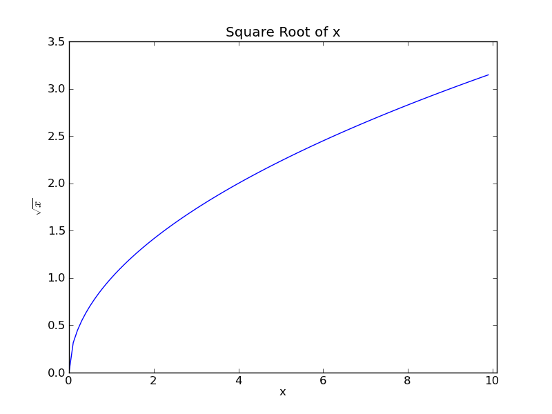

Calculate Square Root using Newton's Method
-------------------------------------------

In this example, we calculate the sqrt of a number using `Newton's method
<http://en.wikipedia.org/wiki/Newton's_method#Square_root_of_a_number>`_.
The problem of finding the square root can be expressed as:

.. math::

     n = x^2

Which can be rearranged as:

.. math::

     f(x) = x^2 - n

Using Newton's method, we can find numerically the approximate point at which
:math:`f(x) = 0`. Repeated applications of the following expression yield
increasingly accurate approximations of the Square root:

.. math::

    f(x_k) = x_{k-1} - \frac{{x_{k-1}}^2 - n}{2x_{k-1}}

Turning this into a practical solution, the following code calculates the square
root of a floating point number. An initial approximation is refined using
Newton's method until further refinements agree to within a small degree.

.. code-block:: c

    /* sqrt.c */
    /* Jonathan P Dawson */
    /* 2013-12-23 */
    
    /* find absolute value of a floating point number*/
    
    float fabs(float n){
        if (n < 0.0) {
            return - n;
        } else {
            return n;
        }
    }
    
    /* approximate sqrt using newton's method*/
    
    float sqrt(float n){
        float square, x, old;
        x = 10.0;
        old = 0.0;
        while(fabs(old - x) > 0.000001){
            old = x;
            x -= (x*x-n)/(2*x);
        }
        return x;
    }
    
    /* test sqrt function*/
    
    void main(){
        float x;
        for(x=0.0; x <= 10.0; x+= 0.1){
            file_write(x, "x");
            file_write(sqrt(x), "sqrt_x");
        }
    }

Note that the code isn't entirely robust, and cannot handle special cases such
as Nans, infinities or negative numbers.  A simple test calculates
:math:`\sqrt{x}` where :math:`-10 < x < 10`.

