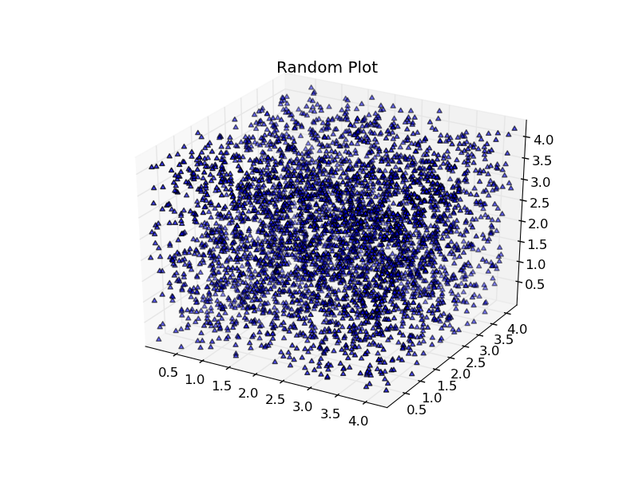

Pseudo Random Number Generator
------------------------------

This example uses a 
`Linear Congruential Generator (LCG) <http://en.wikipedia.org/wiki/Linear_congruential_generator>`_ to generate Pseudo Random Numbers.

.. code-block:: c

    /*globals*/
    unsigned long int seed;
    
    void srand(unsigned long int s){
        seed = s;
    }
    
    unsigned long rand(){
        const unsigned long a = 1103515245ul;
        const unsigned long c = 12345ul;
        seed = (a*seed+c);
        return seed;
    }
    
    void main(){
        unsigned i;
        for (i=0; i<4096; i++){
            file_write(rand(), "x");
            file_write(rand(), "y");
            file_write(rand(), "z");
        }
    }

